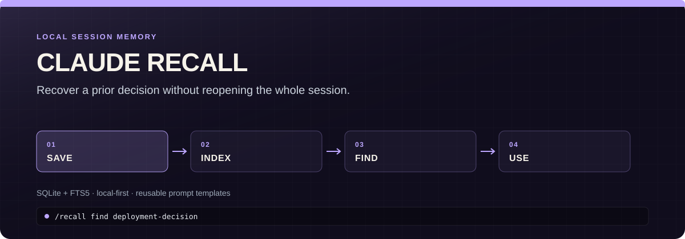

<p align="center">
  
</p>

# claude-recall-cli

Mine reusable lessons from Claude Code, Codex, and Gemini CLI without shipping raw transcripts. Local SQLite and FTS5 remain the default. An optional private Cloudflare context plane lets every harness search the same human-reviewed memory through MCP.

The repository keeps its original Claude-specific name during the prototype. A rename is gated on real multi-machine use, not the expanded architecture alone.

## What it does

- Captures retained transcripts from Claude Code, Codex, and Gemini CLI through cheap `SessionEnd` hooks.
- Extracts credential-redacted voice signals and reusable recipes into local `recall.db`.
- Searches local memory without any cloud dependency.
- Optionally sends only staged, redacted candidates through a durable local outbox to Cloudflare.
- Exposes Approved memory to all three harnesses through one authenticated MCP server.
- Keeps Git instructions and owning project documents authoritative.

Start with local recall. Add the cloud layer only when multiple machines need one reviewed index.

## Install

**One-liner (clone + install):**

```bash
git clone https://github.com/nino-chavez/claude-recall-cli.git ~/.claude/recall-cli && bash ~/.claude/recall-cli/install.sh
```

**Or via curl:**

```bash
curl -fsSL https://raw.githubusercontent.com/nino-chavez/claude-recall-cli/main/install.sh | bash
```

This installs `/recall` and `/recall-scan` as global Claude Code slash commands available in every session.

## Usage

| Command | Description |
|---------|-------------|
| `/recall save` | Extract an entry from the current session |
| `/recall find <query>` | Search saved entries by keyword |
| `/recall list` | Show recent entries |
| `/recall show <id>` | Show full entry details |
| `/recall use <id>` | Get the prompt template ready to use |
| `/recall use <id> --var key=value` | Fill in template variables |
| `/recall stats` | Library statistics |
| `/recall analyze` | Analyze a session for quality patterns |
| `/recall quality` | Quality trends across recent sessions |
| `/recall quality --days 7` | Quality trends for last N days |
| `/recall verify <id>` | Rate a session outcome (pass/fail, satisfaction, followup) |
| `/recall backfill` | Backfill analysis metrics on older entries |
| `/recall-scan` | Scan recent sessions for recall-worthy patterns |
| `/recall-scan 7` | Scan last N days |
| `/recall-scan all` | Scan all sessions |

## Artifact miner — what did Claude create, and did it survive?

`artifact-miner.py` is the artifact-side complement to Poe: it streams every
session transcript (including nested subagent transcripts) and extracts
creation events — files written, Bash heredoc/tee file creates, repeated Bash
procedure signatures — then checks which written paths still exist on disk,
merged to a repo from a removed worktree, or are gone (tmp/scratchpad
ephemera). Use it to find throwaway scripts worth promoting to durable tools
and conversational procedures worth codifying.

| Command | Description |
|---------|-------------|
| `python3 artifact-miner.py` | Mine all sessions → `artifact-mine.json` in cwd |
| `python3 artifact-miner.py --out results.json` | Choose the output path |
| `python3 artifact-miner.py --projects-dir PATH` | Non-default sessions dir |

Before this existed, one-off variants were rebuilt in throwaway sessions 12+
times (`mine_sessions.py`, `mine_failures_v3.py`, `friction_mining_v2.py`, …)
— all written to `/tmp` and lost. If you're about to write a new session
miner, extend this one instead.

## Poe — voice corpus

`poe-extract.py` mines human turns from Claude Code and Codex sessions to build a queryable corpus of how you actually think, correct, and push back. Signals (corrections, preferences, rationale, rejections, declarations, approvals) are stored in the same `recall.db` under `voice_signals` + FTS5 with `source_client` provenance.

| Command | Description |
|---------|-------------|
| `python3 poe-extract.py init` | Ensure the `voice_signals` schema exists in `recall.db` |
| `python3 poe-extract.py extract` | Bulk scan all sessions into `~/.claude/poe/corpus.jsonl` |
| `python3 poe-extract.py extract --session PATH` | Single-session scan → DB (hook mode) |
| `python3 poe-extract.py publish` | Load `corpus.jsonl` into `recall.db` |
| `python3 poe-extract.py assemble` | Build `~/.claude/poe/stack.md` from the DB |
| `python3 poe-extract.py query <terms>` | FTS5 search the corpus, emit a markdown block to paste as context |
| `python3 poe-extract.py run` | extract + publish + assemble (full refresh) |
| `python3 poe-extract.py catchup --include-codex --include-gemini` | Idempotently ingest Claude, active/archived Codex, and retained Gemini transcripts |

### Continuous generation (SessionEnd hook)

Claude Code, Codex, and Gemini CLI can share the same fast queue and scheduled worker. The hook only records transcript identity; database work happens out of band.

Claude Code uses:

```json
{
  "hooks": {
    "SessionEnd": [
      {
        "matcher": "",
        "hooks": [
          {
            "type": "command",
            "command": "python3 ~/Workspace/dev/tools/claude-recall-cli/poe-extract.py enqueue",
            "timeout": 5
          }
        ]
      }
    ]
  }
}
```

Codex uses the same command under `SessionEnd` with a three-second timeout. Its queue record includes `session_id`, so the worker can find a transcript after Codex moves it into `archived_sessions`. Gemini supplies the retained JSON transcript path in the same hook input. Add `--include-codex --include-gemini` to the worker's `drain-queue` arguments for catch-up of missed events.

## Optional shared context plane

The Cloudflare layer is a private reviewed index, not a transcript warehouse and not a replacement for shared instructions.

```bash
python3 poe-extract.py drain-queue --include-codex --include-gemini
python3 context-plane.py baseline  # once: do not upload existing history
python3 context-plane.py stage
with-secret 'Cloudflare recall-context-plane' \
  --as RECALL_CONTEXT_TOKEN -- \
  python3 context-plane.py push
python3 context-plane.py status
```

New records always arrive as `Candidate`. Only a human-authorized MCP call can mark one `Approved`. Normal searches default to Approved memory and omit Candidate, Contradicted, Superseded, and Stale records.

`baseline` makes scheduled sync future-facing. Use `stage --backfill` only when you deliberately want to review historical local records in the cloud.

Read these in order:

1. [Architecture](docs/architecture.md) — data flow, state model, and failure behavior.
2. [Cloudflare deployment](docs/deploy-cloudflare.md) — D1, Queues, R2, AI Gateway, secrets, and recovery.
3. [Client connections](docs/connect-clients.md) — Claude Code, Codex, and Gemini hooks plus MCP adapters.
4. [Deployment receipt](docs/deployment-receipt.md) — what the live private prototype has actually proved.
5. [Field-validation gate](docs/field-validation.md) — evidence required before a rename or reflective blog post.

Deduplication is automatic. Delete a raw transcript only after its current path and modification time are covered by `ingest_watermark`, and after any durable lesson has been promoted into a recipe or canonical project documentation.

### Codex closeout and retention

The global `$session-closeout` skill handles the judgment step that automatic mining cannot. Invoke it explicitly, or use closeout language such as `close out this task`, `wrap this session up`, `prepare this task for archive`, or `make this archive-ready`. The prompt hook routes those phrases to the skill; the skill verifies evidence, promotes a reusable recipe only when warranted, and emits an `Archive-safe: yes|no` receipt. It never archives or deletes a task.

Review and trust newly added hooks through Codex's `/hooks` interface. A practical retention policy is:

1. Close out substantive tasks before archiving them.
2. Keep canonical project truth in the owning repository and reusable procedures in `recall.db`; do not create recap files for chronology alone.
3. Let `SessionEnd` enqueue the transcript and let the launchd worker advance its watermark.
4. Keep a short grace window for archived raw transcripts, then delete only files whose exact path and current modification time remain covered by `ingest_watermark`.
5. Keep active task transcripts. Prune disposable build artifacts in Codex worktrees independently; they are not session memory.

## Automatic scanning (session-end hook)

By default, scanning is manual. To automatically scan for recall-worthy sessions every time a Claude Code session ends, add a `SessionEnd` hook to your global settings (`~/.claude/settings.json`):

```json
{
  "hooks": {
    "SessionEnd": [
      {
        "matcher": "",
        "hooks": [
          {
            "type": "command",
            "command": "python3 ~/.claude/commands/recall-scan.py --days 1 --min-score 30 --limit 5 >> ~/.claude/recall-scan.log 2>&1",
            "timeout": 30
          }
        ]
      }
    ]
  }
}
```

This logs candidates to `~/.claude/recall-scan.log` after each session. Review the log periodically and `/recall save` the sessions worth keeping.

You can adjust `--min-score` (0-100, default 30) and `--days` to tune sensitivity.

## How it works

- Entries are stored in `~/.claude/recall.db` (SQLite with FTS5 full-text search)
- `/recall save` analyzes the current session transcript and extracts intent, tools used, outcome, and a reusable prompt template with `{{variable}}` placeholders
- `/recall-scan` scores past sessions by efficiency, output, focus, and intent clarity to find sessions worth saving
- No dependencies beyond Python 3 stdlib + SQLite

## Quality analysis

`/recall analyze` and `/recall quality` assess sessions across two independent layers:

### Compliance — graded (A-F)

**Did Claude follow its own documented system prompt rules?** These checks have ground truth — documented instructions with right/wrong answers.

- **Tool selection** — Bash calls that should have used Read/Edit/Grep/Glob (rules extracted from Claude Code's system prompt)
- **Anti-patterns** — Retry loops, exploration dead-ends, edits without prior reads, excessive sub-agents

Rules sourced from [Claude Code system prompts](https://github.com/Piebald-AI/claude-code-system-prompts) via `baseline.json`. Update when Claude Code releases new tool guidance.

### Process metrics — descriptive only, NOT graded

**How did the session behave?** These metrics describe session shape, not quality. Task complexity, model choice, and session intent all affect them legitimately. A research-heavy Opus session is not "worse" than a quick Haiku fix.

- **Planning** — File thrash ratio (same file edited repeatedly)
- **Session shape** — Classified as `direct_execution`, `brief_alignment`, `research_then_build`, `extended_discussion`, `late_start`, or `exploration_only`
- **Cost efficiency** — Tokens per productive tool call (heavily model-dependent)

Thresholds in `thresholds.json` are user-tunable.

### Outcome tracking (manual, for future correlation)

The database schema includes `outcome_verified` and `had_followup_fix` columns. Set these manually on saved entries to build a dataset correlating process metrics with actual outcomes. This is the path to real quality measurement.

### Versioning

Every output includes `heuristic_version` (currently v3). Bump `HEURISTIC_VERSION` in `recall-cli.py` when you change scoring rules. Scores from different versions should not be compared.

### What this is NOT

This analysis is **not derived from or comparative to any Anthropic internal evaluation framework**. Compliance checks whether Claude followed its published rules. Process metrics are descriptive telemetry. Neither claims to measure the quality of the code produced or the user's satisfaction with the session.

## Update

```bash
git -C ~/.claude/recall-cli pull
```

Symlinks mean updates take effect immediately.

## Uninstall

```bash
rm ~/.claude/commands/recall.md ~/.claude/commands/recall-cli.py
rm ~/.claude/commands/recall-scan.md ~/.claude/commands/recall-scan.py
rm -rf ~/.claude/recall-cli
# Optionally remove the database: rm ~/.claude/recall.db
```

## License

MIT
