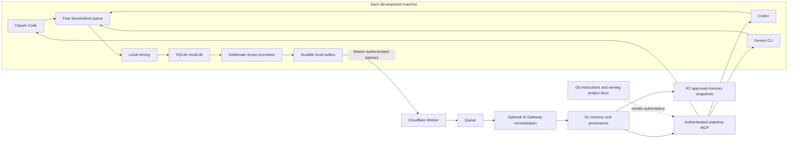

# The context plane

The tool now has one local memory on each machine and one optional private cloud index. Claude Code, Codex, and Gemini CLI feed the same local miner. They can all query the same reviewed cloud memory through MCP.

Git still owns instructions and project truth. The context plane holds evidence that may help an agent find that truth. It does not turn a transcript observation into policy.

## What crosses the network

Only manually saved `recipes` cross the network. Automatically mined
`voice_signals` are transcript-derived evidence and remain local, even after
credential masking. A recipe crosses only after the closeout or `/recall save`
path has deliberately promoted its intent, outcome, and optional reusable
prompt. Credential redaction runs again before the outbox write. Raw messages,
assistant responses, transcript fields, mined phrases, and evidence excerpts
stay on the machine where they were created.

Cloud provenance contains identifiers only: source client, machine, session ID,
source timestamp, local table, local row ID, and the `manual_recipe` curation
marker. The Worker rejects automatic signals and transcript-derived provenance
fields. Stable event IDs make retries safe. A local item is not complete when
the Worker accepts it; it becomes `acknowledged` only after the Queue consumer
records a processed receipt.

## Memory states

| State | Meaning | May guide normal work? |
|---|---|---|
| `Candidate` | Locally curated recipe waiting for cloud review | No |
| `Approved` | A human accepted the memory for reuse | Yes, unless Git contradicts it |
| `Contradicted` | Later evidence conflicts with it | No |
| `Superseded` | A newer memory replaced it | No |
| `Stale` | Its explicit lifetime ended | No |

Ingestion can only create `Candidate`. AI normalization can shorten or clean a candidate, but it cannot set status. The MCP write tool requires a reason, and `Superseded` also requires the replacement memory ID.

## Why these Cloudflare services

- D1 is the primary store because relational provenance, state transitions, uniqueness, and FTS5 search matter more than semantic similarity at this stage.
- Queues separate the fast ingest response from distillation and make retries explicit. Delivery is at least once, so the schema uses stable event and memory keys.
- R2 holds replaceable daily snapshots of approved memory. It is not the source of truth.
- AI Gateway is optional. When enabled, it normalizes already-redacted candidates with payload logging disabled. Deterministic pass-through remains the fallback.
- The Worker exposes one stateless Streamable HTTP MCP endpoint, so all three harnesses use the same retrieval contract.

Vector search is intentionally absent. FTS5 is cheaper, easier to inspect, and adequate until failed real queries show that lexical retrieval is the bottleneck.

## Failure behavior

The local database is the offline buffer. A failed upload stays `pending`. An accepted upload stays `sent` until the client sees a `processed` receipt. A failed Queue attempt returns the item to `pending` on the next receipt check. Duplicate delivery is safe because D1 enforces stable IDs.

The daily maintenance job marks expired Candidate or Approved records Stale, deletes old ingest receipts after the configured retention period, and writes a fresh approved-memory snapshot to R2. D1 Time Travel remains the recovery mechanism for the primary store.

## Storage is three separate problems

Do not use one disk-usage number to make a retention decision. Measure these independently:

- **Source evidence:** active and archived harness transcripts. A transcript becomes eligible for local cleanup only after its exact path and modification time are covered by the ingest watermark and its durable lessons have been promoted.
- **Distilled memory:** `recall.db`, the local outbox, D1 rows, and replaceable R2 snapshots. These should grow much more slowly than the source corpus and keep their own retention receipts.
- **Disposable work output:** linked-worktree build directories such as `target/`, `node_modules/`, and `.next/`. Prune these with the worktree reaper; they are neither source evidence nor memory.

The context plane must not solve local disk pressure by copying raw transcripts into cloud storage. Local cleanup stays watermark-gated, and build-output cleanup stays an independent operation.
